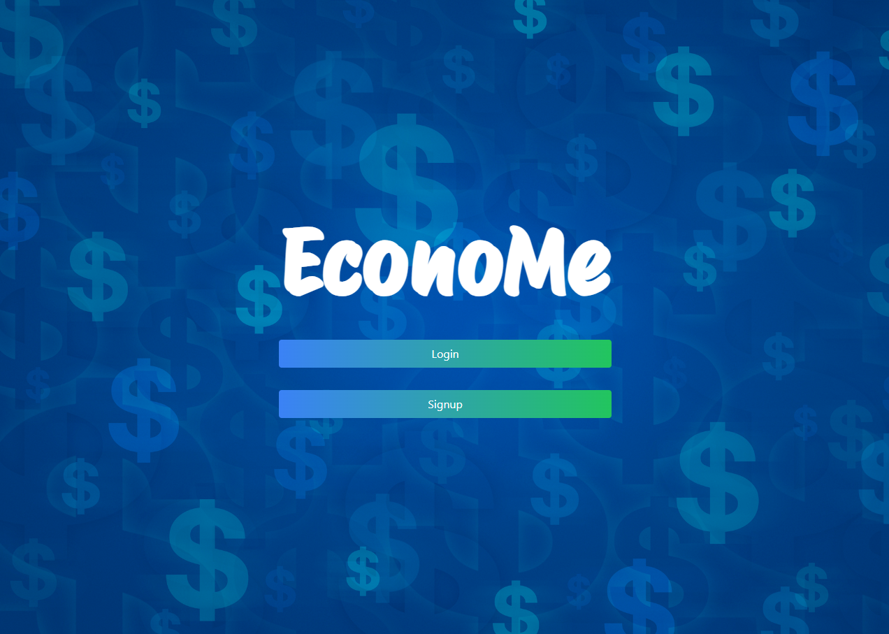

# EconoMe

## Description

Welcome to EconoMe! Our goal is to provide an easy way for a user to view and interact with their budgeting needs. A user can sign up for an account, log in to the account, and create / view a budget that pertains to their needs! Once a budget is created, categories can be added to that budget (cost of living, groceries, automotive, etc.), and transactions (gas, takeout, Netflix) can be added to those categories. This provides for a very easy and interactive way to visualize your money.

## Table of Contents

- [Installation](#installation)
- [Checklist](#checklist)
- [Credits](#credits)
- [Screenshot](#screenshot)
- [License](#license)

## Visuals

## Installation

npm install
npm run dev

## Usage

When opened, you're presented with a login/signup page. After logging in/signing up, you can update or create a budget. Within that budget, you can make multiple categories (which can be flexible or not), and transactions to go in those categories.

## Support

Contact any of the developers for support!

## Authors/Collaborators and acknowledgment

- Garrett Young
- Dana Fuller
- Trevor
- Juan Jimenez
- Brendalee Alcala

### Tools Used:

- Excalidraw
- Tailwind
- Node.js
- MySql & Sequelized ORM
- API Keys
- GET & POST
- Authentication
- Bootstrap
